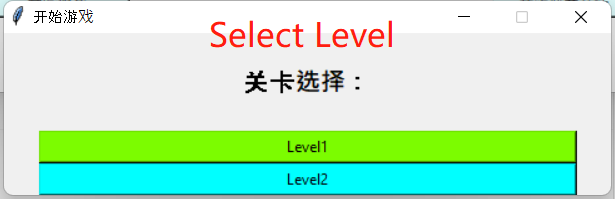
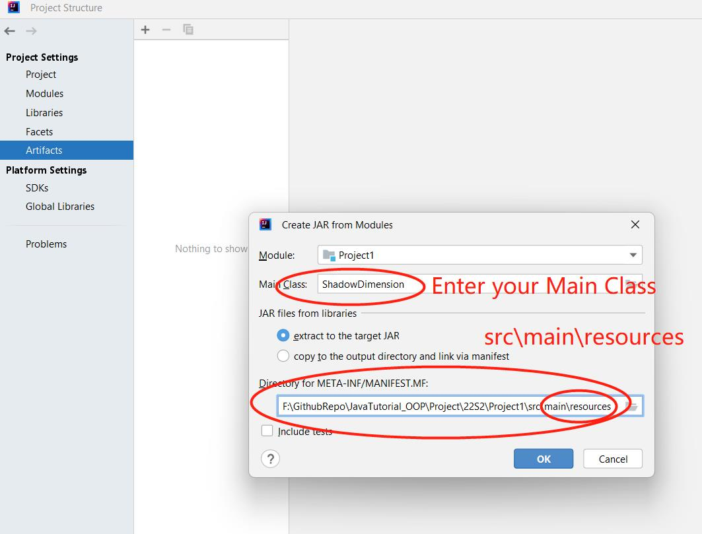

# ShadowDefend_Game

A tower defence Game
   - JAVA OOP.
   - Maven Project Builder.
   - Bagel -- Basic Academic Graphical Engine Library.

### This directory is me personally try to:
1. Compile all java classes into single standalone -Jar file.
2. -Jar file can run, but it needs external folder "res" as Game Data (images, level information etc).
3. Use Python to Combine "-Jar file" and "res" folder to achieve true "standalone double-click to run application".
4. Now it supports Windows PC and MacOS (Intel Chip).
-----

## How To Run on your computer?
1. You need to install latest [JAVA](https://www.oracle.com/java/technologies/downloads/#license-lightbox) to run the program.
1. Download from the release tab and run the program

-----

## Gameplay
Launcher       |  Launcher
:-------------------------:|:-------------------------:
  |  

Upgrade       |  Airplane
:-------------------------:|:-------------------------:
  |  

Level2       |  Overall
:-------------------------:|:-------------------------:
  |  

-----

# Guide to Build your own Java program

## How to Compile into Single -Jar File:

### 1. Use IntelliJ to build a single -jar file.
1. From Top Menu: Select ```*File* -> *Project Structure* -> *Artifact* -> Add "Jar with dependencies"```.
2. Fill in Main Class Field as your own class, say "ShadowDefend"
3. Edit Directory of META-INF: change ```xxxx\src -> xxxx\src\main\resources  ```(**Important!**)
4.  Apply and press OK.
5. From Top Menu: ```Select *Build* -> *Build Artifact* -> *Build*```
6. A file should be generated as: ```"out/artifacts/{YourProjectName}/{YourProjectName.jar}```.
7. Copy ```"res" folder``` and ```"{YourProjectName.jar}"``` into a different folder.
8. Now, open your terminal **in current folder directory** and use following command to run!
   ```java -jar YourProjectName.jar```

#### You can share your game with your friends now!
But Make sure your friend's computer has *[JAVA](https://www.oracle.com/java/technologies/downloads/#license-lightbox)* installed!

Step 2 and 3       |  Step 6 and 7
:-------------------------:|:-------------------------: 
  |   

Step 7       |  Step 8
:-------------------------:|:-------------------------: 
  |   
   

   

---

### 2. Use Python to Package -Jar and Res folder into an executable file (Optional)

With Python Scripts defined in "ShadowDefend_Game_Mac" and "ShadowDefend_Game_Win",
The "Res" folder and -jar file can be combined into a single clickable file with simple GUI start menu.

**Basic Logic**
1. Auto extract "res" folder into system's "temp" folder, 
2. With code inside "Sprite.java" get current "temp" directory of "res" folder
3. Now, the -jar program can access the files inside that "temp->res" folder.
4. Use Python to open a system terminal and call ```java -jar ShadowDefend.jar``` program.
5. In user's view, the program is a standalone single file Application.

Launcher       |  Launcher
:-------------------------:|:-------------------------:
  |  


**Packaging Instructions**:
- Use auto-py-to-exe

  ```pyinstaller -F -w -i icon.ico --add-data="data/*:data" ShadowDefend.py --clean```

- windows:
  ```pyinstaller -F -w -i icon.ico --add-data="data/*;data" ShadowDefend.py --clean```

- Built Path:
  ```ShadowDefend_Game/ShadowDefend_Game/Dist/ShadowDefend```

- Windows one line bat file that automatically build
  ```
  %~dp0
  pyinstaller -F -w -i icon.ico texteditor.py --clean --workpath ./pybuilds/builds --distpath ./pybuilds/dists -n myApp
  ```
